<h2>Introduction</h2>

Dans le domaine du développement d'applications Java, 
la gestion efficace de la persistance des données est essentielle. 
Différentes technologies telles que l'ORM, le JDBC, JPA, Hibernate et Spring Data ont été 
développées pour répondre à ce besoin. Ce travail se concentre sur l'exploration de ces concepts, 
de l'accès aux bases de données avec JDBC à la simplification de la gestion des objets persistants avec 
JPA, en passant par l'utilisation du framework ORM Hibernate et l'outil puissant Spring Data. L'objectif 
est de mettre en avant les avantages, les fonctionnalités et les cas d'utilisation de ces technologies, 
en montrant comment les mettre en pratique.

<h2>Énoncé</h2>
<ol>
  <li>Installer IntelliJ Ultimate</li>
  <li>Créer un projet Spring Initializer avec les dépendances JPA,H2,Spring Web et Lombok</li>
  <li>Créer l'entité JPA Patient ayant les attributs :</li>
  <ul>
    <li>id de type Long</li>
    <li>nom de type String</li>
    <li>date de naissance de type Date</li>
    <li>malade de type boolean</li>
    <li>score de type int</li>
  </ul>
  <li>Configurer l'unité de persistance dans le fichier application.properties</li>
  <li>Créer l'interface JPA Repository basée sur Spring Data</li>
  <li>Tester quelques opérations de gestion</li>
  <ul>
    <li>Ajouter des patients</li>
    <li>Consulter tous les patients</li>
    <li>Chercher un patient par Id</li>
    <li>Mettre à jour un patient</li>
    <li>supprimer un patient</li>
  </ul>
  <li>Migrer de h2 Database vers MySQL</li>
</ol>

<h2>Réalisation</h2>
<ol>
  <li>Installation d'IntelliJ Ultimate</li>

  
La première phase de cette tâche pratique consiste à installer IntelliJ IDEA Ultimate, un environnement de développement intégré (IDE) hautement performant qui servira de base pour le développement de notre application.

  
<li>Création d'un Projet Spring Initializer avec Maven en ajoutant aussi les dépendances suivantes</li>
  
<ul>
    <li>Spring Data JPA</li>
    <li>H2 Database (base de données en mémoire)</li>
    <li>Spring Web (pour les contrôleurs web)</li>
    <li>Lombok (pour la génération automatique de code)</li>
    <li>MySQL Driver</li>
    <li>Thymeleaf</li>
  </ul>

  <li>Création de l'Entité JPA Patient</li>

Ci-dessous sont énumérés les attributs de cette entité 

<ul>
    <li>id (de type Long)</li>
    <li>nom (de type String)</li>
    <li>date de naissance (de type Date)</li>
    <li>malade (de type boolean)</li>
    <li>score (de type int)</li>
  </ul>
 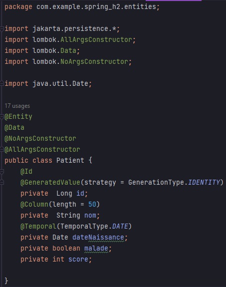

  <li>Configurer l'unité de persistance dans le fichier application.properties pour utiliser H2 Database</li>

Ces lignes de configuration établissent  l'URL de la base de données (H2 en mémoire), activent la console H2 pour une gestion interactive, et spécifient le port (8082) sur lequel l'application sera accessible.

  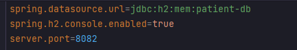

  <li>Création de l'interface JPA Repository basée sur Spring Data</li>

Cette interface "PatientRepository" étend "JpaRepository" pour gérer l'accès aux données de l'entité "Patient". Il fournit des méthodes pour rechercher des patients par différents critères, notamment le statut de maladie, le score, la date de naissance et le nom, ainsi qu'une requête personnalisée pour la recherche.

  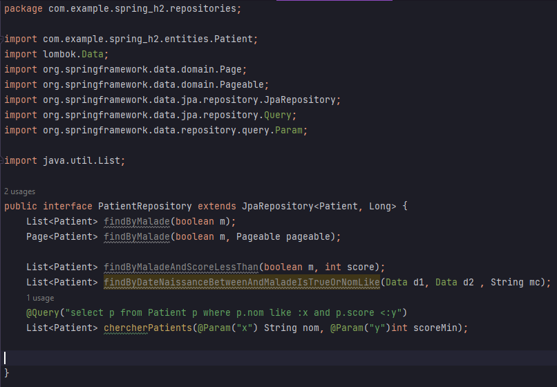

<li>Tests des Opérations de Gestion</li>
<ul>
    <li>Le point d'entrée de l'application Spring Boot , autrement la classe principale (main class) qui contient la méthode</li>
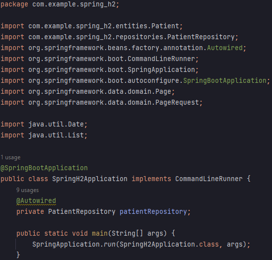
    <li>Ajouter des patients</li>
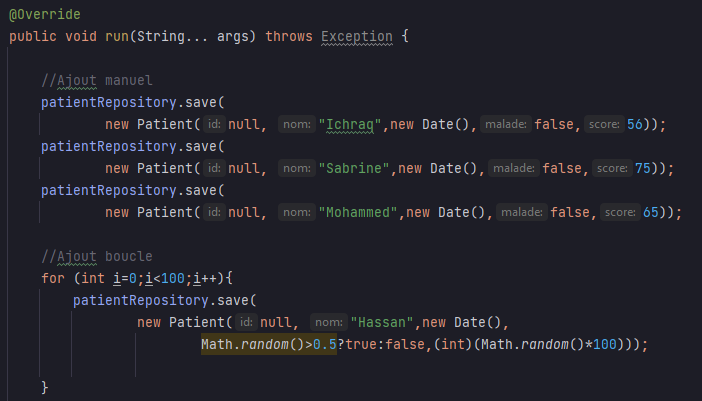
    <li>Consulter tous les patients</li>
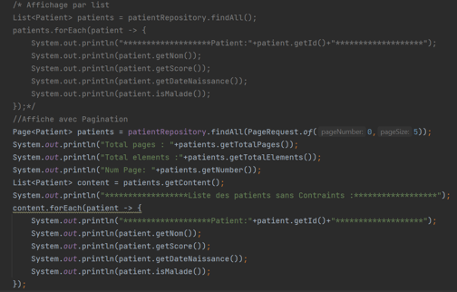
<li>Chercher des patients selon des critéres</li>
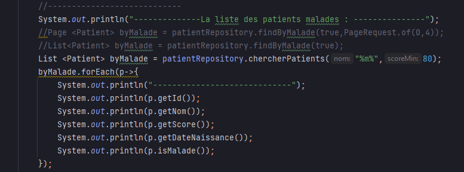
    <li>Chercher un patient par Id</li>
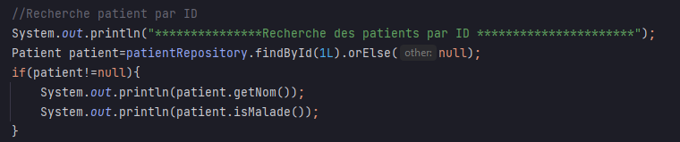
    <li>Mettre à jour un patient</li>

    <li>Supprimer un patient</li>
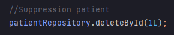
    <li>Exécution avec H2 Database</li>
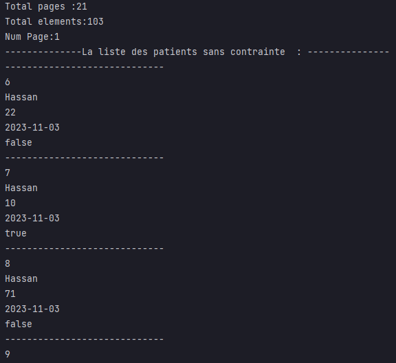
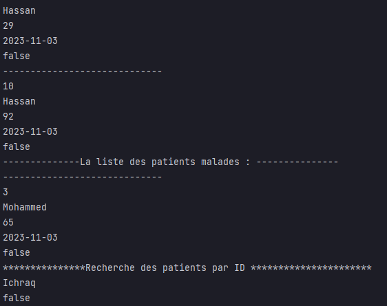
<li> les données dans H2 Database</li>
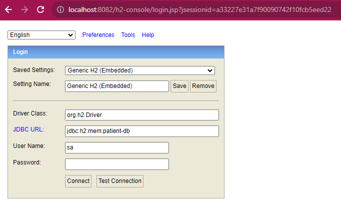
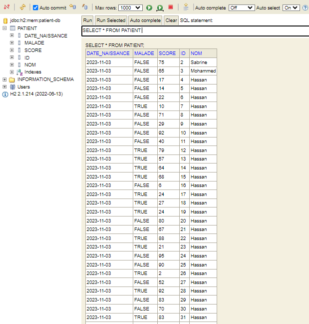
</ul>

<li>Migration de H2 Database vers MySQL</li>

<ul>
<li>Configuration de l'unité de persistance dans le fichier application.properties pour utiliser MySQL</li>
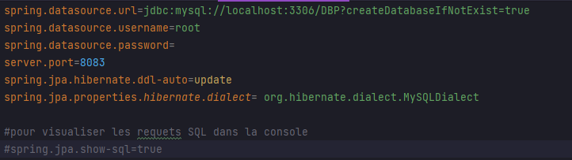
<li>Démonstration</li>

<li> les données dans la base de donnée MySQL</li>
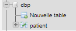
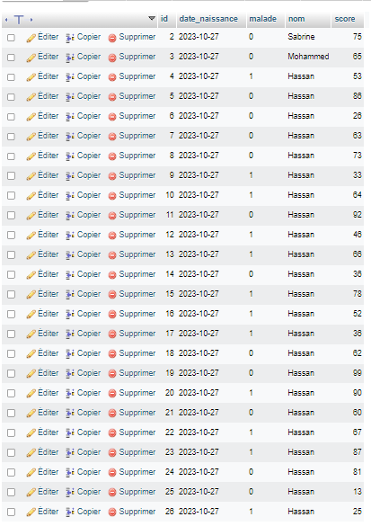
</ul>

<h2>Remarque</h2>

J'ai créé deux versions du projet, l'une appelée "Spring_H2" et l'autre "Spring_MySQL". Chacune de ces versions est configurée pour fonctionner avec une base de données différente, offrant ainsi une flexibilité dans le choix de la source de données en fonction des besoins du projet

</ol>

